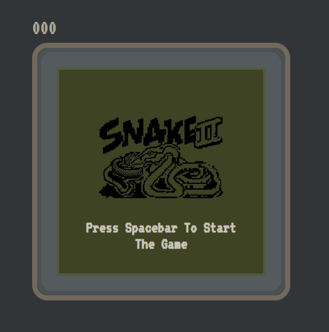

# 
# snake-game-js
<table>
<tr>
<td>
 tutorial de programación de freeCodeCamp.org , se creo un juego de serpiente retro inspirado en el icónico Snake de Nokia utilizando HMTL, CSS y JavaScript. Usando JS aprenderás a dibujar el tablero de juego, crear la serpiente y la comida generada aleatoriamente, hacer que la serpiente se mueva, aumentar el tamaño de la serpiente cuando come, y aumentar su velocidad. también aprenderás a mantener la puntuación, realizar un seguimiento de las colisiones de la serpiente, y mostrar tu puntuación más alta.
</td>
</tr>
</table>

## Demo
>[!Note]
>Aquí tiene una demostración en vivo:  https://TheDaniel23xd.github.io/snake-game-js/

## Site

### Landing Page
se creo un juego de serpiente retro inspirado en el icónico Snake de Nokia utilizando HMTL, CSS y JavaScript.

## Authors

- [@Ade-mir](https://github.com/Ade-mir)

